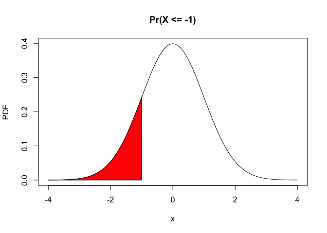
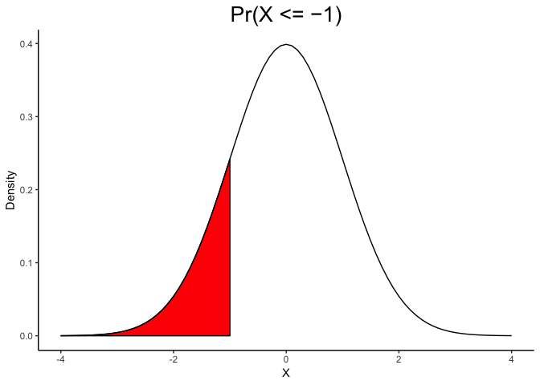
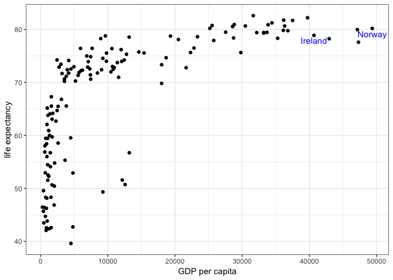

Activity Three for Lab3
================
Taehoon Ha
09/26/2018

``` r
library(ggplot2)
library(gapminder)
library(tidyverse)
```

    ## ── Attaching packages ─────────────────────────────────────────── tidyverse 1.2.1 ──

    ## ✔ tibble  1.4.2     ✔ purrr   0.2.5
    ## ✔ tidyr   0.8.1     ✔ dplyr   0.7.6
    ## ✔ readr   1.1.1     ✔ stringr 1.3.1
    ## ✔ tibble  1.4.2     ✔ forcats 0.3.0

    ## ── Conflicts ────────────────────────────────────────────── tidyverse_conflicts() ──
    ## ✖ dplyr::filter() masks stats::filter()
    ## ✖ dplyr::lag()    masks stats::lag()

``` r
library(ggrepel)
data("gapminder")
```

### Problem 1

In lecture 3 notes a density plot of a normally distributed random variable with area under the curve was created using base R graphics:

``` r
curve(dnorm, from = -4, to = 4, ylab = "PDF", main = "Pr(X <= -1)")
coord.x = c(-4, seq(-4,-1, by=0.1), -1)
coord.y = c(0, dnorm(seq(-4, -1, by=0.1)), 0)
polygon(coord.x, coord.y, col = 2)
```



Write R code using ggplot2 to recreate the density plot with area under the curve.

``` r
x <- seq(-4, 4, 0.1)

ggplot(data = NULL, aes(x = x, y = dnorm(x))) +
  geom_line() +
  geom_polygon(data = NULL,
               aes(x = c(-4,seq(-4,-1, by=0.1),-1),
                   y = c(0,dnorm(seq(-4,-1, by=0.1)), 0)),
               fill = "red", col = 'black') +
  labs(x = "X", y = "Density", title = "Pr(X <= −1)") +
  theme(plot.title = element_text(hjust = 0.5, size = 20),
        panel.background = element_blank(),
        axis.line = element_line(colour = "black"))
```



### Problem 2

-   Load gapminder data.
-   Create a plot for 2007 year data only: "GDP per capita" vs. "Life expectancy"
-   Annotate european countries with "GDP per capita" &gt; 40000

#### 1) Using geom\_text()

``` r
temp <- gapminder %>%
  filter(year == 2007) %>%
  select(country, continent, gdpPercap, lifeExp)

temp2 <- temp %>%
  filter(continent == 'Europe', gdpPercap > 40000)

temp %>% ggplot(aes(x=gdpPercap, y=lifeExp)) + 
  geom_point() +
  theme_bw() +
  labs(x = "GDP per capita", y = "life expectancy") +
  geom_text(data = temp2,
            aes(x = gdpPercap, y = lifeExp, label = country),
            color = 'blue',
            nudge_y = -1)
```



#### 2) Using geom\_text\_reple()

``` r
temp <- gapminder %>%
  filter(year == 2007) %>%
  select(country, continent, gdpPercap, lifeExp)

temp2 <- temp %>%
  filter(continent == 'Europe', gdpPercap > 40000)

temp %>%
  ggplot(aes(x = gdpPercap, y = lifeExp)) + 
  geom_point() +
  theme_bw() +
  labs(x = "GDP per capita", y = "life expectancy") +
  geom_text_repel(data = temp2,
                  label = temp2$country,
                  color = 'blue',
                  force = 0,
                  nudge_y = -1)
```


