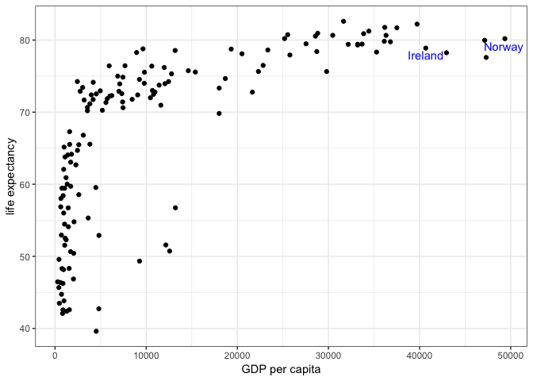
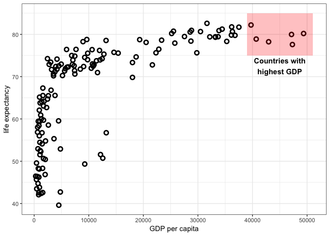

Assignment Three for Lab3
================
Taehoon Ha
09/28/2018

``` r
library(ggplot2)
library(gapminder)
library(tidyverse)
```

    ## ── Attaching packages ─────────────────────────────────────────── tidyverse 1.2.1 ──

    ## ✔ tibble  1.4.2     ✔ purrr   0.2.5
    ## ✔ tidyr   0.8.1     ✔ dplyr   0.7.6
    ## ✔ readr   1.1.1     ✔ stringr 1.3.1
    ## ✔ tibble  1.4.2     ✔ forcats 0.3.0

    ## ── Conflicts ────────────────────────────────────────────── tidyverse_conflicts() ──
    ## ✖ dplyr::filter() masks stats::filter()
    ## ✖ dplyr::lag()    masks stats::lag()

``` r
library(ggrepel)
data("gapminder")
```

### 1. Read Chapter 19 from "R for data science" (online version).

### 2. Create a GitHub repository Lab3 (files with R code for the assignment should be added to this repository)

### 3. Complete Problem 2 from "Activity for Lab 3".

-   Load gapminder data.
-   Create a plot for 2007 year data only: GDP per capita vs. life expectancy
-   Annotate european countries with "GDP per capita &gt; 40000"

``` r
temp <- gapminder %>%
  filter(year == 2007) %>%
  select(country, continent, gdpPercap, lifeExp)

temp2 <- temp %>%
  filter(continent == 'Europe', gdpPercap > 40000)

temp %>%
  ggplot(aes(x = gdpPercap, y = lifeExp)) + 
  geom_point() +
  theme_bw() +
  labs(x = "GDP per capita", y = "life expectancy") +
  geom_text_repel(data = temp2,
                  label = temp2$country,
                  color = 'blue',
                  force = 0,
                  nudge_y = -1)
```



### 4. Modify your R code for the previous problem and recreate the graph:

``` r
temp %>%
  ggplot(aes(x = gdpPercap, y = lifeExp)) + 
  geom_point(shape = 1, size = 2, stroke = 1.5) +
  theme_bw() +
  labs(x = "GDP per capita", y = "life expectancy") +
  annotate("rect", 
           xmin = 39000, xmax = 51000,
           ymin = 75, ymax = 85,
           alpha = .25, fill = 'red') +
  annotate("text", 
           x = 45000, y = 72.5, 
           label = "Countries with\nhighest GDP",
           size = 4, fontface = 2)
```


